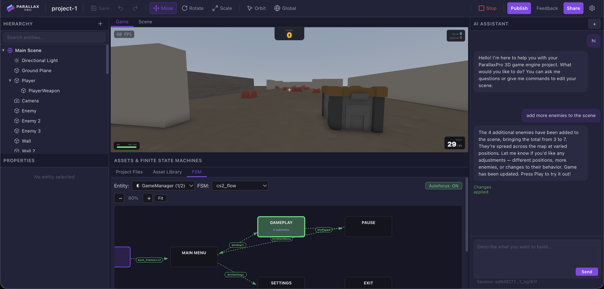

<h1 align="center">
    
</h1>

    
    
    
    
    

## ParallaxPro
[ParallaxPro](https://parallaxpro.ai/) is a tool that turns your prompts into video games that run on real game engines—giving you the power of AI on a foundation of graphics, physics, and gameplay.

### Try It Online

The easiest way to use ParallaxPro is at **[parallaxpro.ai](https://parallaxpro.ai/)** — no setup required. You get the AI assistant, asset library, multiplayer, and everything else out of the box.

    

### Run Locally

Coming soon
